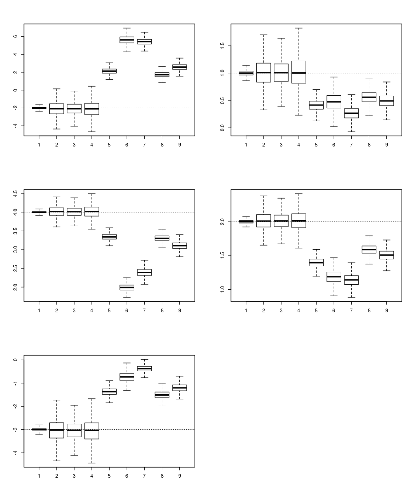

# rcalibration
Implements Generalized Regression Calibration (and Related) Estimators for Measurement Error Correction.

This package implements a generalized regression calibration estimator, for the correction of measurement error in standard modelling contexts. This generalized estimator contains the more common replicate-based estimators (Carroll, et al., 2006) as a special case and incorporates a broad correction that establishes consistency under a broad class of error models. The package further provides utilities related to these corrections, notably the capacity to compute optimal weights when taking a convex combination of error-prone proxies and utilities for estimating the structure of errors observed in data. 

## Installation
Install the latest version from github. Note, this requires `devtools`. 
```{r}
install.packages("devtools")
devtools::install_github("dylanspicker/rcalibration")
```

## Usage
The following example shows a brief simulation of the package in use. 
```r
# Using 'MASS' for 'mvrnorm'
library(rcalibration)
library(MASS)

set.seed(3141592)

# Normal Example
n <- 500 # number of observations
reps <- 2500 # number of experiments to run

results <- matrix(nrow=reps, ncol=9*(4+1))

for(ii in 1:reps){
  X <- mvrnorm(n, mu=c(1,2,1,-1), Sigma = matrix(c(1, 0.2, 0.1, 0.3,
                                                   0.2, 2, 0.1, 0.1,
                                                   0.1, 0.1, 3, 0.5,
                                                   0.3, 0.1, 0.5, 0.5), nrow = 4, ncol = 4))
  
  W1 <- X + mvrnorm(n, mu=c(0,0,0,0), Sigma = diag(c(0.7, 0.4, 0.8, 0.2)))
  W2 <- X * replicate(4, runif(n, 0, 2))
  W3 <- X + replicate(4, rt(n, 8))
  
  Y <- cbind(rep(1, n), X) %*% as.matrix(c(-2, 1, 4, 2, -3)) + rnorm(n)
  
  ## Selecting 'optimal' Weights
  W <- list(W1,W2,W3)
  
  # Naive Models
  mod.naive.1 <- lm(Y~W1)
  mod.naive.2 <- lm(Y~W2)
  mod.naive.3 <- lm(Y~W3)
  
  Wmean <- (1/3)*(W1+W2+W3)
  mod.naive.mean <-lm(Y~Wmean)
  
  
  wts.obj <- getOptimalWeights(W)
  Wopt <- Reduce("+", lapply(1:3, function(ii){ wts.obj$weights[[ii]]*W[[ii]] }))
  mod.naive.opt <- lm(Y~Wopt)
  
  ## Grabbing some of the Imputed Values
  Xhat.opt <- generalizedRC(W)
  Xhat.eq <- generalizedRC(W, weights='equal')
  Xhat.rand <- generalizedRC(W, weights=c(0.8, 0.05, 0.15))
  
  mod.cor.opt <- lm(Y~Xhat.opt)
  mod.cor.eq <- lm(Y~Xhat.eq)
  mod.cor.rand <- lm(Y~Xhat.rand)
  
  mod.true <- lm(Y~X)
  
  results[ii, ] <- cbind(coef(mod.true),coef(mod.cor.opt),coef(mod.cor.eq),
                         coef(mod.cor.rand),coef(mod.naive.1),coef(mod.naive.2),
                         coef(mod.naive.3),coef(mod.naive.mean),coef(mod.naive.opt))
}
params <- c(-2, 1, 4, 2, -3)

par(mfrow=c(3,2))
for (ii in 1:(4+1)) {
  boxplot(results[,seq(ii,9*(4+1),by=5)], outline=F)
  abline(h=params[ii], lty=3)
}
```

